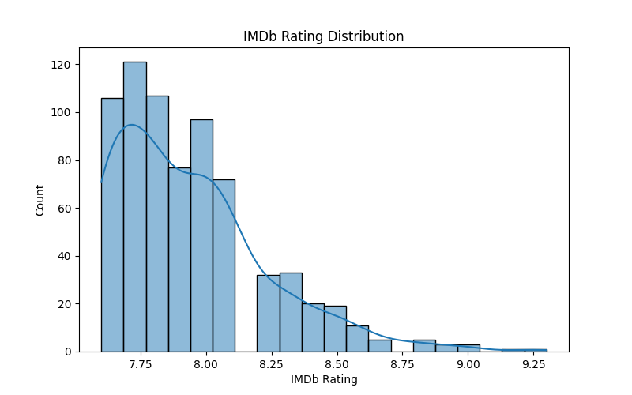
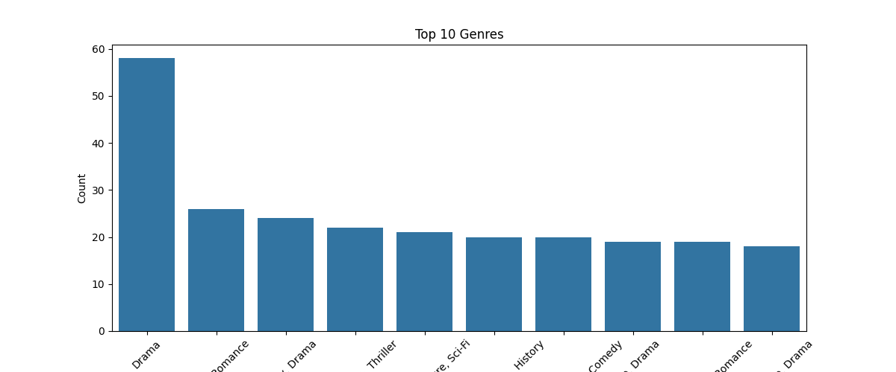
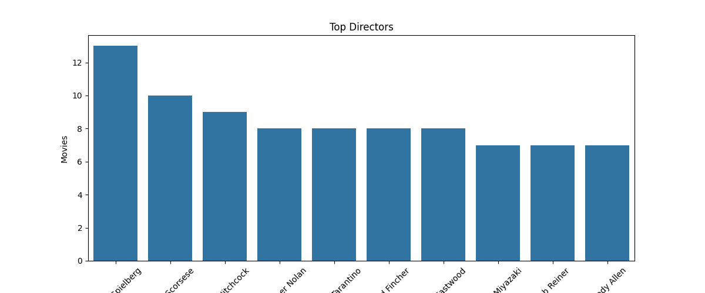
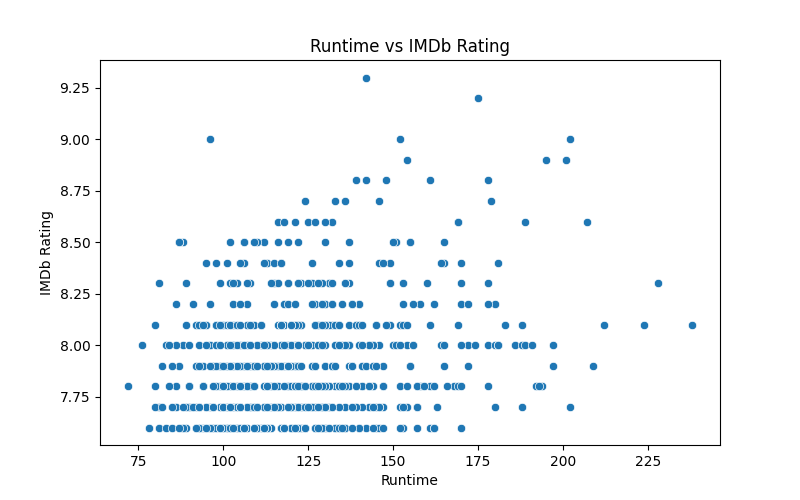
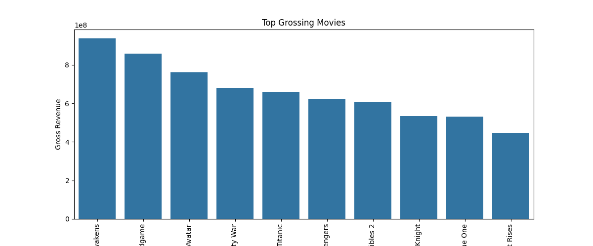
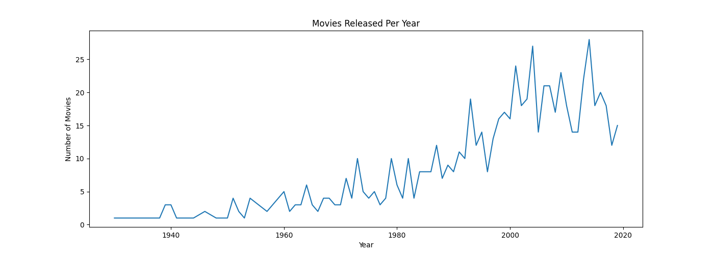
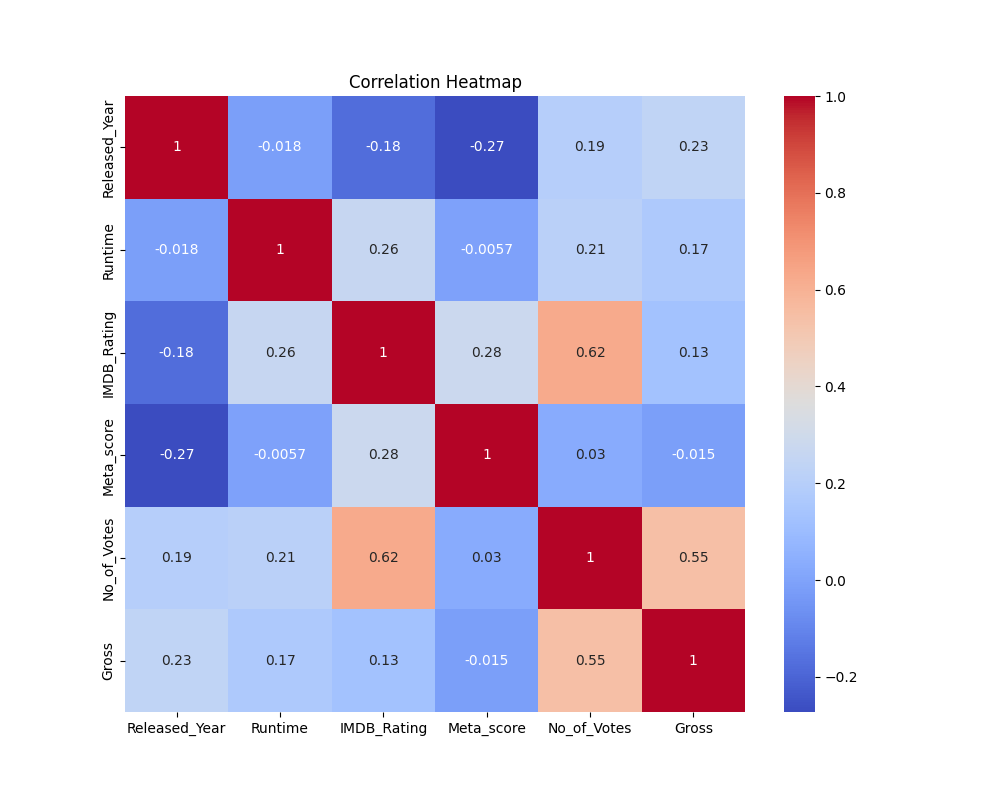
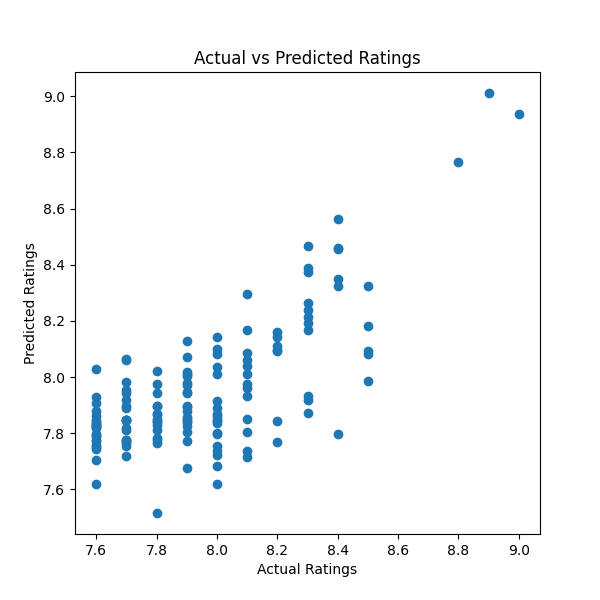

# 🎬 Movie Rating Analysis

## 📌 Internship Details

- **Internship Domain:** Data Science  
- **Organization:** CodTech  
- **Project Title:** Movie Rating Analysis
- **Intern ID:** CITS801  

---

# 📖 Project Overview

This project focuses on analyzing movie data and predicting IMDb ratings using Machine Learning techniques.

The project includes:
- Data Cleaning
- Exploratory Data Analysis (EDA)
- Data Visualization
- Feature Engineering
- Machine Learning Prediction
- Power BI Dashboard Creation

The goal of this project is to identify important factors affecting movie ratings and build a prediction model using Python and Scikit-Learn.

---

# 🛠️ Technologies Used

- Python
- Pandas
- NumPy
- Matplotlib
- Seaborn
- Scikit-Learn
- Power BI
- Jupyter Notebook
- VS Code

---

# 📂 Project Structure

```text
movie-rating-analysis/
│
├── dashboard/
│   └── dashboard.pbix
│
├── data/
│   └── movies.csv
│
├── images/
│   ├── imdb_rating_distribution.png
│   ├── top_genres.png
│   ├── top_directors.png
│   ├── runtime_vs_rating.png
│   ├── top_grossing_movies.png
│   ├── movies_per_year.png
│   ├── correlation_heatmap.png
│   └── prediction_results.png
│
├── notebooks/
│   └── movie_rating_analysis.ipynb
│
├── results/
│   └── predictions.csv
│
├── README.md
├── requirements.txt
└── .gitignore
```

---

# 📊 Dataset Information

The dataset contains movie-related information such as:

- Movie Title
- Released Year
- Genre
- Runtime
- IMDb Rating
- Meta Score
- Director
- Votes
- Gross Revenue
- Star Cast

Dataset Source:
Kaggle IMDb Movie Dataset

---

# 🧹 Data Cleaning

The following preprocessing steps were performed:

- Removed missing values
- Removed duplicate rows
- Converted runtime into numerical format
- Converted gross revenue values into numeric type
- Cleaned released year column
- Prepared data for visualization and prediction

---

# 📈 Exploratory Data Analysis (EDA)

Several visualizations were created to understand movie trends and patterns.

## Key Visualizations

### 🎨 IMDb Rating Distribution

Shows the distribution of movie ratings.

```markdown

```

---

### 🎨 Top Genres

Displays the most common movie genres.

```markdown

```

---

### 🎨 Top Directors

Shows directors with highest number of movies.

```markdown

```

---

### 🎨 Runtime vs IMDb Rating

Analyzes relationship between movie runtime and ratings.

```markdown

```

---

### 🎨 Top Grossing Movies

Displays movies with highest revenue.

```markdown

```

---

### 🎨 Movies Released Per Year

Shows movie release trends over years.

```markdown

```

---

### 🎨 Correlation Heatmap

Displays correlation between numerical features.

```markdown

```

---

# 🤖 Machine Learning Model

A Linear Regression model was used to predict IMDb ratings.

## Features Used

- Runtime
- Meta Score
- Number of Votes
- Gross Revenue
- Released Year

## Target Variable

- IMDb Rating

---

# 📉 Model Evaluation

The model was evaluated using:

- Mean Absolute Error (MAE)
- Root Mean Squared Error (RMSE)
- R² Score

Prediction results were visualized using scatter plots.

```markdown

```

---

# 📁 Prediction Output

Predicted movie ratings are stored in:

```text
results/predictions.csv
```

---

# 📊 Power BI Dashboard

An interactive Power BI dashboard was created to visualize:

- Genre Distribution
- Top Directors
- Rating Distribution
- Gross Revenue Analysis
- Runtime vs Ratings
- Movies Released Per Year

Dashboard File:

```text
dashboard/movie_dashboard.pbix
```

---

# 🔍 Key Insights

- Drama genre dominates highly rated movies.
- Movies with higher Meta Scores generally receive better IMDb ratings.
- Revenue and number of votes positively influence ratings.
- Popular directors consistently produce highly rated movies.
- Movie production increased significantly after 1990.

---

# 🚀 Future Improvements

Future enhancements can include:

- Advanced Machine Learning models
- Recommendation System
- Deep Learning prediction
- Sentiment analysis on movie reviews
- Deployment using Streamlit or Flask

---

# ✅ Conclusion

This project successfully analyzed movie datasets, generated insights through visualizations, and built a machine learning model to predict IMDb ratings.

The project demonstrates practical skills in:
- Data Cleaning
- Data Visualization
- Machine Learning
- Dashboard Development
- Data Analytics